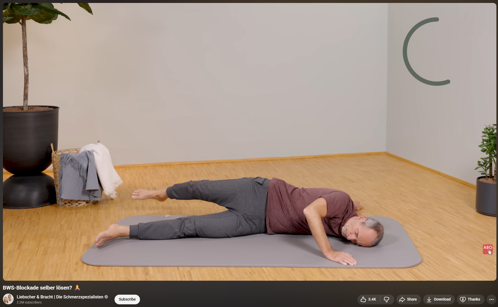
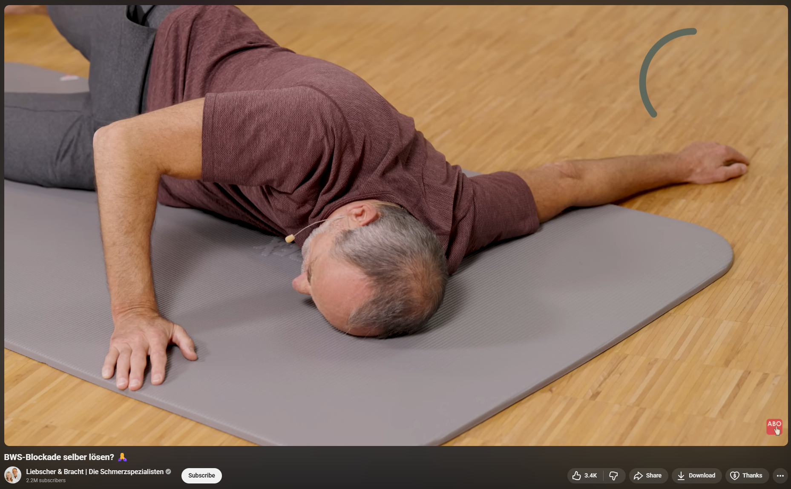
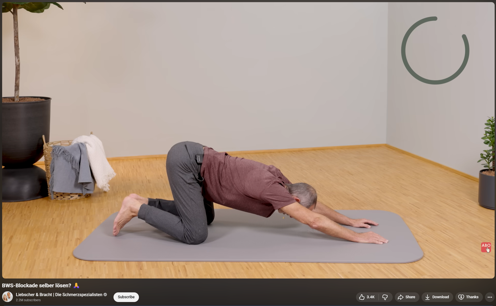

My Story with Costochondritis
===================================
I’ve wanted to make a post in this sub for quite a while, but I kept putting it off because I wanted to wait until I was fully recovered. I thought I had reached that point a few times already, but it always came back quickly. After being a silent reader for more than two years, I finally decided not to wait any longer and share my story.

The post is structured chronologically and very thorough so that others may relate to my ‘case’ and hopefully find some relief. Reading posts from others certainly helped me a great deal. For context, I am a 36-year-old male from Switzerland. I have a healthy weight, don’t take any medications, don’t smoke, don’t use any substances, and drink only moderately. In fact, I had a pretty clean medical record until the beginning of December 2022, when this unfortunate journey began. Feel free to skip this massive wall of text and head over to the TL;DR section(s).

How it Started and Medical Exams
----------
One morning after my commute, I suddenly felt a strong swaying sensation and had to quickly grab a nearby handrail to prevent me from falling. When I arrived at the office, a colleague suggested that I lie down for a few minutes. This helped a bit, but the dizziness returned as soon as I stood up again. I decided to work from home and didn’t think too much of it at the time. About a week later, it happened again. This time it was less intense, but from then on, I started having regular dizziness spells which miraculously stopped during my two-week Christmas holiday. 

One night in early January 2023, I had to drive my wife to the ER where she had to undergo an emergency surgery. Her doctors informed us that the procedure would take 45 minutes and that they would call me once it was over. I went for a walk in the park and returned 90 minutes later to ask about her well-being. They told me that the surgery is still ongoing. I tried to stay calm by distracting myself and thought maybe it had just been slightly delayed. After getting no call for another hour, I returned to the info desk only to be told that they have no new information other than that the surgery was still ongoing. I could barely stop myself from imagining the worst, but another long hour later, I experienced what was probably the first panic attack of my life. Thankfully, everything went well in the end and she recovered quickly. During those intense hours I had rather severe dizziness but was too absorbed to make the connection. 

A week later I went to my PCP where I had a comprehensive blood and urine panel done, including hematology, inflammation markers, kidney and liver function tests, electrolytes, lipids, glucose metabolism, thyroid function and ferritin. Everything turned out to be within the regular bounds. Due to my family history (my mother and grandmother had WPW syndrome, and all three of them, including my great-grandfather, had early heart attacks) she quickly hinted at some potential heart rhythm disorder and scheduled a stress test. She suggested that I get a smartwatch with ECG functionality to record data during a spell. Until then, I hadn’t even considered a cardiac cause. I purchased a Galaxy watch and quickly became obsessed with my heart rate. In hindsight, this was the initial spark that led to my health anxiety (i.e. cardiophobia). The stress test was clear, as were the ECGs I had recorded myself during a few dizziness spells. After a clear orthostatic blood pressure test, she referred me to a cardiologist and neurologist. 

One morning while waiting for the next appointment I had sharp pain on the left side of my lower chest as well as feeling dizzy. I had my brother drive me to the ER where I was admitted immediately. While lying there hooked up with electrodes and seeing both my heart rate and systolic blood pressure climbing to 180, I was sure that I was dying. I calmed down quickly once the doctors told me that my ECG and troponin were clear. I told them about my recent tests and my future appointments. They asked if I had been under a lot of stress lately. I told them my wife’s emergency surgery, a critical surgery of my mom, who survived a heart attack the year before, and the stress of finishing my PhD. They then quickly pointed toward panic attacks, gave me something for the pain, a prescription for beta blockers and potassium, and sent me home. A blood test at my PCP a few days later showed that I could stop taking the potassium. I continued the beta blockers for roughly two months, as they helped to calm me down. They were also very helpful when a fellow PhD student committed suicide, which left many of us with grief and also a sense guilt. 

Three weeks later I had a full neurological workup consisting of EEG, brain MRI with contrast, nystagmus test, and a few other checks. After being told that every test was clear, my dizziness spells stopped completely. The neurologist said that stress or anxiety could explain the dizziness and suggested thinking about medication. The cardiologist ran a seven-day Holter test with an event button that I pressed a few times during sharp chest pains and a dizzy spell. I also had an echocardiogram (ultrasound of the heart). She said there were no structural abnormalities and that my heart looked perfectly healthy. Even though I was going to the gym 4-5 times per week at that time, she recommended adding about 90 minutes of cardio per week.

After all those tests, my mind was at ease, and I was no longer scared of a climbing heart rate. At that time, my symptoms had improved significantly. However, the sharp pain in the chest persisted and slowly became stronger. Sometimes I had shooting pain even when my mind was completely occupied with other things, which suggested to me that there had to be a physiological origin. In the meantime, my PCP tested for Helicobacter pylori (a common stomach bacterium), which came back clear. While doing my own research I discovered the famous video of Bob and Brad about costochondritis. I had my wife poke the spot between my shoulder blade and spine on the left side, which sent me straight to the ceiling. I was very relieved with this discovery; finally everything seemed to fit together.

Shortly after, I noticed that I had more pain the day after intense chest workouts. I started to go easier and replace certain exercises such as bench press and dips, and eventually stopped training the chest completely. I went back to my PCP with this new theory and asked for a referral to physiotherapy, which she agreed to, even though she had never heard of costochondritis. When she looked it up, she said that my symptoms didn’t really fit and that it might be the slipping rib syndrome. I called the PT beforehand to make sure they are familiar with costochondritis. They said they were, but focused almost entirely on my chest rather than my back. The nine PT sessions did alleviate my pain by roughly 70% - previously, I hadn’t been able to sleep on my belly due to the intense pain in my sternum. I had taken a small break from lifting weights but I picked it up again after the PT encouraged me to continue with light exercises. The first time everything was fine, but two days after the second workout the pain was unbearable. Eventually, I found this subreddit and decided to stop lifting weights. This wasn’t an easy decision and took its toll, both physically and mentally, but it was certainly for the better.

In August 2023 we went on vacation, where my panic attacks started again, and with them the pain increased. My wife is a psychotherapist, and she started to suspect agoraphobia. Back at home I treated myself with muscle relaxers that I had asked my PCP for. After three days, I was free of any symptoms for almost two months. 

Toward the end of 2023 the symptoms became worse again, despite having stopped lifting weights. I decided to see a different PT for two more sessions. He immediately realized that the problem originated in my back and performed some chiropractic adjustments and massaged tight, sore spots all around my neck, shoulder and chest. He knew about blocked ribs but had never heard of costochondritis or Tietze. After the second session, he was surprised to hear that I was still in pain and suggested I undergo further medical testing. If it hadn’t been for Reddit, that suggestion would have sent me into another panic attack. This PT also encouraged me to try working out again. I went in extra light, using only half the weight I used to but with double the repetitions. Unfortunately, I had to stop after the second workout due to a really bad flare-up.

I started reading the PDFs shared in this sub, watched the Youtube videos of Steve, and ordered the Backpod, which I’ve been using since almost two years now. At first it was extremely painful, even with multiple pillows under my head. After a few weeks I didn’t need any pillows at all. Around that point, using the Backpod started to give me some relief. I was also doing the sitting twist rotations, which almost always produced some clicking sounds in the back. Feeling my body improve lifted an enormous mental weight.

Things got worse again in April 2024 after starting a new job. I put myself under a lot of pressure to prove myself, and that tension quickly built up. I lost my appetite and was constantly stressed. I quickly lost all the weight I had gained after I stopped working out. Things were starting to stabilize eventually when suddenly I received the news that a former classmate had suffered a cardiac arrest. The funeral was beautiful, but seeing his widow and their two boys was really tough. Later, when I visited his widow, she told me  details of his death. I am sure getting it off her chest was helpful to her, but it took me a long time to process this visit. 

My body was tense most of the time, yet I somehow managed to keep going. Last summer, we went on a ten-day road trip through Norway. I just couldn’t enjoy it the way I should have. I had panic attacks almost every day. Luckily, my wife always managed to calm me down quickly, but I remained tense even during the times between. After the vacation I realized I had to take action again. My quality of life was down the drain. Back at home I decided to give osteopathy a try, and at the same time started psychotherapy (talk therapy). Additionally, I took beta blockers for three months. This time I specifically asked for Propranolol, taking 2x40 mg per day. During that time, my stomach and digestion were constantly upset, so I also took digestive drops daily. The osteopath said he knew costochondritis and identified all my problematic areas and trigger points immediately. He also gave me a few exercises to do at home. I showed him the Backpod and talked about everything I had learned from the countless hours I had spent reading about this condition. He freed up my spine and loosened my muscles and fascia. I also found great relief from his treatment of the diaphragm. I had tears of joy in my eyes when I was finally able to breathe normally again. Additionally, it was incredibly reassuring to have an expert essentially confirm that it was most likely something musculoskeletal. He didn’t call it costochondritis though and preferred to call it a functional problem. Together with psychotherapy, this helped me regain control over my life. Within three months I was about 80% recovered and most importantly, felt full of hope again. 

By the end of 2024, after seven sessions with my osteopath, the dull pain in my sternum was gone, as was the sharp pain right where my T3 connects to the sternum. On about four days per week, I still felt a burning sensation about 10 cm (4”) to the left of the sternum. My osteopath advised me to get back into light exercises. I wanted to follow his advice, but only after being pain-free for a few weeks. He told me to come back after I started lifting weights again. I was in this 80% recovery for roughly six months, with minor ups and downs. Sometimes I had a week or two with barely any pain, followed by bad flare-ups that sometimes made me anxious again and made me question everything. I kept doing my stretches and using the Backpod, but couldn’t find any relief beyond those 80%. 

Eventually, things got worse again, and by July 2025 I decided it was time to take action once more. Earlier that year, I had become the father of a wonderful baby girl, and carrying her around for just a couple of minutes brought back the dull pain in my chest. Since my previous osteopath hadn’t really treated the burning sensation in my chest and the residual pain, I decided to see a different osteopath nearby. This one didn’t do any manual treatment at all. He was fully into TCM and simply told me that I was a ‘warm type’ and that I should adjust my diet by reducing things like raw vegetables. He also talked about ‘heart energy’ while claiming to know costochondritis. Needless to say, I never went back for another treatment. I picked up running as an intermediate step because weight lifting was (and still is) out of reach. I never liked cardio, but I needed some kind of outlet. It didn’t take long before I got a sharp pain in my sternum again, which did scare me a bit since it happened while running. Usually, the pain never reacted to a rising heart rate, which always gave me reassurance. 

So I went back to my previous osteopath who said he still remembered me because I was a ‘special patient’. His treatment gave me relief immediately, and he encouraged me to keep running but to take it slower at first. This time I only went for three sessions. After a few weeks into it, I started to actually enjoy running, and within three months I managed to run 15 km (9.3 miles) without a break. My resting heart rate had gone down, and I felt much better overall being somewhat back in shape (although with a different body composition).

One day while running, I suddenly felt short of breath and was convinced that this was it. I called my wife and started the call by giving her my location, telling her I probably had a medical emergency. She calmed me down, the pain subsided, and I even managed to finish my run. Still, this incident left me anxious and pondering for a couple of days because I was dead sure it wasn’t just a panic attack. My wife convinced me to give in and ask my PCP whether I should do some tests. The troponin test was clear and so was the ECG at my PCP’s office despite the panic attack I had during the recording. It was very reassuring to see a clean ECG while having all the symptoms. She could only speculate about the cause, but reassured me enough to continue running. A week later, it happened again while walking with the stroller. This time I didn’t go into panic mode despite the sharp pain that made it hard to breathe. The pain wrapped around about 120° of my ribcage on the lower left side. I suspected a pinched nerve, went home and found relief after doing a dead hang.  

Thanks to Reddit, I also decided to add massages into the mix, which I had always neglected. My rib area turned out to be extremely sore. At first, the therapist could barely touch it. After a few sessions, it became clear that he managed to achieve lasting relief there. He also worked on my tight neck, rhomboids, and serratus anterior, as well as both pec muscles. After eight sessions, he said we weren’t progressing as expected and recommended an osteopath he had personally seen and successfully referred many family members and friends to.

Current Situation
----------
I decided to give it one last try before accepting that this residual pain, which can flare up badly on some days, as something permanent. Two weeks ago, I went into his office and told him my whole story. After a few minutes, he immediately suspected Tietze’s syndrome. I then continued my story, after which he examined me. He identified a blocked T3 and released it. To free the spinal segments, he used the ‘fist-in-the-back’ technique, but for releasing my T3 afterward he did something slightly different. It was something I didn’t recognize from previous treatments. It felt very targeted and was somewhat painful. At this point I was wondering if it was ever truly released before. He then did the test Steve described, where you press down on the rib joints next to the spine like piano keys. He confirmed that my left T3 is less mobile than the surrounding rib joints. He also treated my diaphragm, which was very tense. He did not know Steve or the Backpod, but liked the idea of it very much. He talks about and treats costo exactly the way I learned about it on this subreddit. I find his background very impressive. He started as a masseur, then he became a physiotherapist, and now holds a master’s degree in osteopathy. He’s also very passionate about his work and loves to explain everything in detail. He said the pain around my shoulder (serratus, etc.) comes from rolling it forward as a protective posture. I felt no pain and no burning for an entire week. I was incredibly relieved to finally find someone who truly knows and treats costochondritis. 

I went for a second session last week, where he was happy to find that my T3 wasn’t getting blocked again. He also said it was already more mobile than last time. At the beginning of that session I had some burning and sore areas from the massage the day before, but was pain-free right after his treatment. I dared to believe this chapter was finally closing. Then, out of nowhere, the burning sensation crept back. Maybe this is just the muscles and fascia reorganizing and adjusting, as he told me, but it got worse over the last weekend with intense pain in the sternum. I had been so relieved, thinking I had finally found the solution, but now I am struggling to keep my hope up.

I only ever got clicking or cracking in my thoracic spine when using the Backpod, peanut ball, doing Steve’s ballistic twists, or pulling back my elbows, but I never had any popping at the sternum. I can only make it click at the front when I press from the left side, roughly at nipple height, toward my sternum. Then it clicks right at the junction of the ribs and the costal cartilage. Since the treatment, however, I’ve had the sternum pop a few times. Is that a good sign?

TL;DR
----------
This post got longer than anticipated, but sitting down and compiling my whole story was actually great and might help some of you relate. Below is a condensed summary in the style of  ‘What works for you’ threads.

Duration
----------
Since February 2023

Probable Causes
----------
* Intense weightlifting
* Bad posture (sitting at a desk all day)
* Stress
* Anxiety - developed due to costo, but made things worse and kept fueling it for sure

List of Symptoms
----------
These are or were my main symptoms
* Sharp pain where T3 connects to the sternum
* Dull pain in the centre of the chest when bending down
* Sore xyphoid / lower ribs / oblique muscles
* Burning or tearing of the pectoralis muscles at varying spots from the centre to the armpits
* Spasming chest
* Clicking sound in the thoracic spine when using the Backpod, peanut ball, doing Steve’s ballistic twists, or pulling back my elbows 
* Clicking at the junction of the ribs and the costal cartilage when I press from the left side, roughly at nipple height, toward my sternum
Here are some symptoms that I think one could call secondary effects
* Pain and or numbness in the left arm
* Pain in the jaw 
* Dizziness - to some extent. Maybe also linked to a very tight neck?
And here are some symptoms I am pretty sure are connected to anxiety. I found that they increase in intensity the more I focus on them. On the other hand, I had these typically vanish after receiving clear test results or getting reassurance
* Tingling sensation on the top of my skull
* Globus sensation in the throat
* Dizziness - to some extent
* “Falling” sensation in the stomach
* Cold hands

Diagnostic Tests
----------
Over the past two years I’ve had the following tests
* Comprehensive blood and urine panels (including inflammation markers, thyroid, kidney, liver, electrolytes, lipids, glucose, and ferritin)
* Stress test
* Multiple resting ECGs and a 7-day Holter monitor with event button
* Echocardiogram / heart ultrasound
* Orthostatic blood pressure test
* Brain MRI with contrast, EEG, and nystagmus test
* Helicobacter pylori test

Overlapping Health Issues
----------
I am not aware of other health issues, other than the anxiety / panic disorder that I developed during this journey. 

What Helps
----------
Like many people in this sub, I have tried countless exercises and stretches. What ended up being helpful to me 
* Backpod - targeting the spine itself as well as slightly to the left and right of it, hips above the floor. Sometimes I also use rotated 90°
* Ned’s two-tennis-ball sock on which I do crunch-like stretches or to massage my trigger point next to the left should blade
* For stretching my chest, I sometimes do classic doorframes stretch, though I prefer doing one side at a time that lets me better target specific areas. I also do a stretch my osteopath showed me
* I do dead hangs every day for at least one minute at a time. I also twist my upper body and lift me knees while hanging.
* Tiger balm is great for making the pain more diffuse and distracting the nerves so I can stop focusing on it.
On a sidenote I also take magnesium, Vitamin D and Omega 3 every day, but I am not sure if it helps.

What Does Not Help
----------
I tried foam rolling for quite some time, but always ended up with sore floating ribs.

Yet To Try
----------
* Neuropathic pain, i.e. try amitriptyline as suggested by Steve
* Dry needling
* Looking into autoimmune diseases

Pain Levels
----------
I get days with zero symptoms. Usually there’s some mild burning every other day - maybe a 2 on a 0-10 scale. When things get bad, especially when I start to get anxious and focus on the pain, it can reach 8. 

How Much My Costo Has Healed
----------
I guess I am about 80% recovered compared to the worst times. It’s hard to measure because I might just have become more sensitive over time. I no longer get dull pain when carrying our baby or bending forward. Also running doesn’t make things drastically worse. Still, like right now I get bad flare-ups.

A Big Thank You
----------
Thank you so much, Ned, for creating this subreddit and for actively helping so many people. And thank you, Steve, for inventing the Backpod, for your helpful videos on Youtube. You both spend countless hours here and provide invaluable explanations and reassurance to those in need.
Also, a huge thank you to everyone who has shared their own story here, especially those who fully recovered and came back to motivate and guide others. Your posts gave me perspective and hope during my darkest moments and truly made a difference.

----------

Screenshots taken from https://www.youtube.com/watch?v=iu-OEBEdiV8&t=303s
