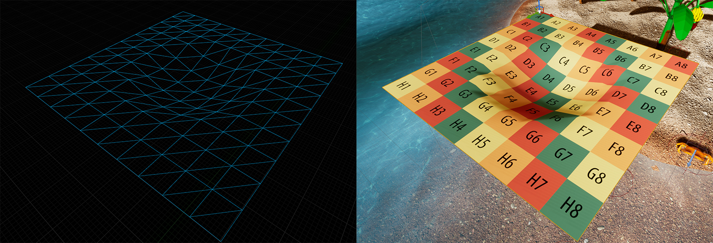
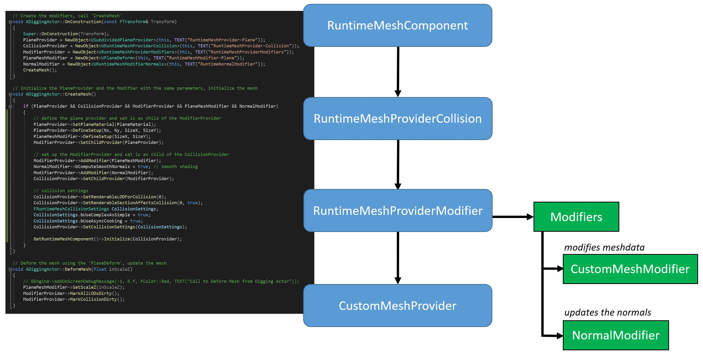

Example for the usage of the Runtime Mesh Component for Unreal Engine 4
===================================
I decided to put this example on GitHub after I struggled some time to wrap my head around the RMC plugin. Down below you can see how the providers and modifiers are organized.
* This example contains a simple provider to create a subdivided plane mesh, modified at runtime. It shows how multiple providers and modifers are chained.
* The example contains an interface to BP.

To test the example simply install the RMC plugin and copy the content of the source folder to your source folder. If you also want to use the BP RuntimemeshActor copy it from BP_Actor to your Content.

About RMC
----------
Get it on https://github.com/KoderzUnreal/RuntimeMeshComponent.
For information on installation of the plugin, usage and everything else check out the [documentation.](https://runtimemesh.koderz.io/)
Join the RMC [Discord](https://discord.gg/KGvBBTv). 
Other basic examples of the features of the RMC can be found [here.](https://github.com/TriAxis-Games/RuntimeMeshComponent-Examples)
A more advanced example project can be found [here.](https://github.com/Moddingear/Hexagons)

----------

